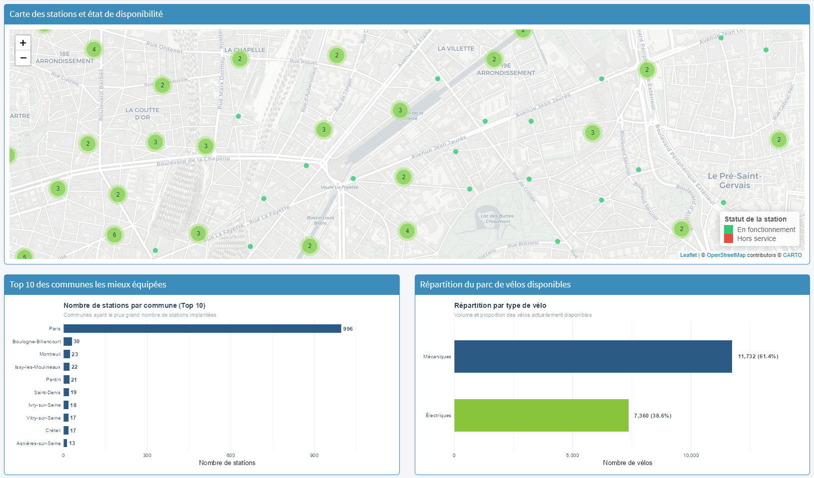

# Tableau de bord Vélib' — Analyse DataViz

### Analyse du tableau de bord

La carte interactivepermet de repérer immédiatement la répartition des stations grâce à un fond de carte bien lisible. Le regroupement par zones évite de surcharger l'écran, avec la légende pour indiquer si oui ou non une station est active.

Le classement des communes s'appuie sur des barres horizontales pour lire le nom des villes en un coup d'œil. On constate un fort déséquilibre : Paris domine largement le réseau avec près de 1 000 stations, loin devant le reste des communes.

Enfin, le graphique de répartition des vélos donne l'information essentielle immédiatement, en combinant les volumes bruts et les proportions (61,4 % de vélos mécaniques contre 38,6 % d'électriques).